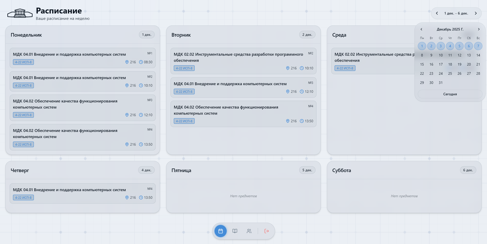
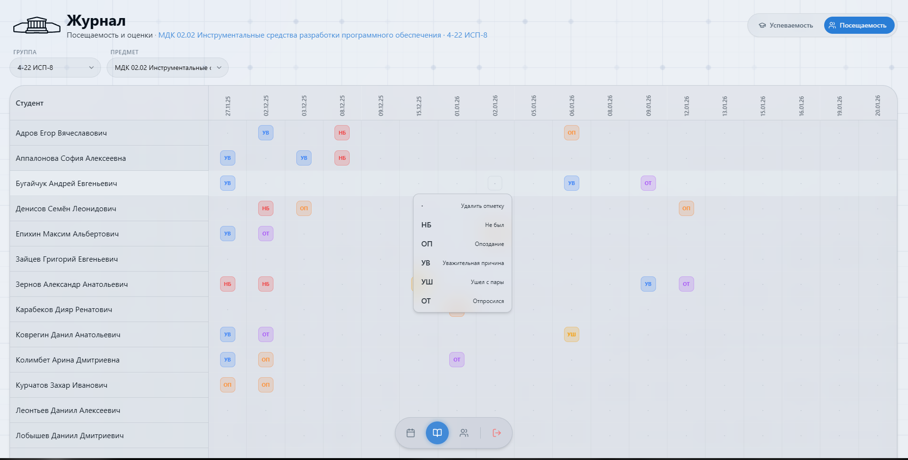
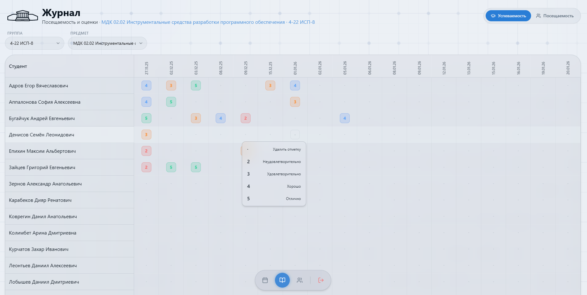

# edu-process-automation-web

Дипломный проект "Разработка веб-сайта для автоматизации учебного процесса"

## Оглавление
1. [Общее описание](#1-общее-описание)
   - [Проблема](#11-проблема)
   - [Функциональность](#12-функциональность)
   - [Стек технологий](#13-стек-технологий)
2. [Клиентская часть](#2-клиентская-часть)
   - [Навигация](#21-навигация-между-экранами)
3. [Серверная часть](#3-серверная-часть)
   - [Особенности](#31-особенности)

---

## 1. Общее описание

### 1.1 Проблема
В наше время преподаватели ведут учет посещаемости и успеваемости на бумажных журналах или электронных таблицах. Это затрудняет обработку данных, приводит к их потере и требует значительных временных затрат со стороны преподавателей.

### 1.2 Функциональность
**Основные возможности:**
- Авторизация
- Просмотр расписания
- Просмотр и выставление посещаемости
- Просмотр и выставление успеваемости
- Просмотр своих групп

### 1.3 Стек технологий
**Фронтенд:**
- nextjs

**Бекенд:**
- ASP.Net
- Entity Framework Core
- BCrypt
- PostgreSQL 16.11
- Python 3.12.3

---

## 2. Фронтенд

### 2.1 Навигация между страницами

**Основные компоненты:**

- Страница авторизации (`LoginWindow`)
  

- Страница расписания (`Timetable`)
  

- Страница посещаемости  (`AttendancePage`)
  

- Страница успеваемости  (`PerformancePage`)
  

- Страница Групп  (`GroupPage`)
  

## 3. Бекенд

Бекенд состоит из апи на ASP.Net, базы данных PostgreSQL и скрипта на Python который обновляет расписание

## 3.1 Особенности

- Создание и аутентификация пользователей
- Автоматическое обновление расписания каждый час
- Автоматическое создание новых предметов, если раньше они не встречались
- Хранение успеваемости и посещаемости студентов

ER диаграмма базы данных

